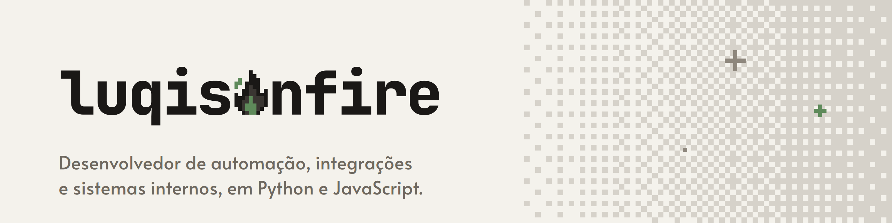

#Opentowork
<picture>
  <source media="(prefers-color-scheme: dark)" srcset="banner-perfil-escuro.png">
  
</picture>

Desenvolvedor de automação, integrações e sistemas internos, em Python e JavaScript. Quase tudo que escrevo roda em repositórios privados de trabalho. O que der para abrir, vai aparecendo aqui.

### Stack

`Python` `Pandas` `Dash` `Flask` `FastAPI` `Playwright` `JavaScript` `Node.js` `React` `SQL` `SQLite` `PostgreSQL`

[LinkedIn](https://www.linkedin.com/in/luqisonfire)[Instagram](https://www.instagram.com/luqisonfire) 
